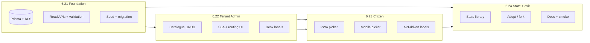

# Grievance Taxonomy Programme — Configurable Categories & Sub-types

**Status:** **Closed — engineering** (2026-05-20). Sponsor sign-off optional on [`master-sprint-624-exit.md`](./master-sprint-624-exit.md).  
**Programme ID:** Master Sprints **6.21 → 6.24** (four sub-sprints).  
**Gate:** **Phase 7 (Sahayak AI)** may start — see [§ Programme exit](#programme-exit-criteria).

**Related:** [`docs/glossary.md`](../glossary.md) §6 · [`ROADMAP.md`](../../ROADMAP.md) Phase 4 grievances · existing `sla_policies` / `grievance_routing_rules` · service-catalogue adopt/fork pattern (Sprint 6.10).

---

## 1. Problem statement

Today grievance **“type”** is a **fixed slug list** in Citizen PWA and mobile (`roads`, `sanitation`, …). Labels live in `@enagar/i18n`. The API accepts any `category` string (2–50 chars) but **does not** maintain a tenant-configurable catalogue. **Sub-types** (e.g. _Garbage not collected_, _Pothole_) are documented in the glossary but **not implemented**.

**SLA** and **routing** already key off `category_match` in `sla_policies` and `grievance_routing_rules`, but operators cannot edit those rules or define new categories without **code deploys** or **SQL/seed** changes.

Municipalities and State need to:

- Turn categories on/off per ULB.
- Add local categories (e.g. _Heritage zone nuisance_).
- Maintain sub-types for Desk triage and field routing.
- Optionally inherit a **statewide reference library** (like global services).

---

## 2. Goals & non-goals

### Goals

| #   | Goal                                                                                                   |
| --- | ------------------------------------------------------------------------------------------------------ |
| G1  | **Data-driven catalogue** — categories + sub-types stored per tenant (with optional global templates). |
| G2  | **Citizen UX** — PWA + mobile load active catalogue for selected ULB; sub-type step on file.           |
| G3  | **Operator UX** — Tenant Admin: CRUD catalogue, SLA policies, routing rules (no raw JSON).             |
| G4  | **State UX** — State Admin: publish global grievance taxonomy; tenants adopt/fork/deactivate.          |
| G5  | **Backward compatibility** — existing grievances and seeds keep working; migration maps legacy slugs.  |
| G6  | **Validation** — `POST /grievances` rejects unknown/inactive category (and subtype when required).     |

### Non-goals (this programme)

| Item                                                                            | Deferred to                                                                            |
| ------------------------------------------------------------------------------- | -------------------------------------------------------------------------------------- |
| ML triage / auto category suggestion                                            | Phase 8                                                                                |
| Per-sub-type SLA overrides beyond existing rule engine                          | Later tuning sprint                                                                    |
| Grievance **workflow** designer changes                                         | Out of scope                                                                           |
| Mobile offline composer category cache beyond 7-day TTL                         | Optional 6.23 stretch                                                                  |
| Changing `grievance_no` format to embed category code (`GRV/KMC/2026/SAN/4421`) | **Optional** 6.24 — feature-flagged; default keeps current `GRV-{TENANT}-{YEAR}-{seq}` |
| WhatsApp / voice filing                                                         | Phase 12                                                                               |

---

## 3. Target architecture

### 3.1 Data model (new tables)

Mirror the **service catalogue** inheritance pattern (`global_*` + `tenant_*` + `source`).

```
global_grievance_categories
  code (PK), name (jsonb en/bn/hi), icon, sort_order, is_active, docket_code (3–4 char, optional)

global_grievance_subtypes
  code, global_category_code (FK), name (jsonb), sort_order, is_active

tenant_grievance_categories
  id, tenant_id, code, global_category_code?, name (jsonb override), icon?, sort_order,
  is_active, source (global_adopted | forked | tenant_only), created_at, updated_at
  UNIQUE (tenant_id, code)

tenant_grievance_subtypes
  id, tenant_id, category_code (tenant scope), code, global_subtype_code?, name (jsonb),
  sort_order, is_active, source, ...
  UNIQUE (tenant_id, category_code, code)

grievances (alter)
  + subtype_code VARCHAR(50) NULL   -- optional until citizen UI ships; then required when subtypes exist
  -- category remains; must match active tenant_grievance_categories.code at create time
```

**RLS:** tenant isolation on all `tenant_*` tables (same pattern as `sla_policies`).

### 3.2 API surface (summary)

| Audience         | Method           | Path                                                       | Purpose                                                    |
| ---------------- | ---------------- | ---------------------------------------------------------- | ---------------------------------------------------------- |
| Public / citizen | `GET`            | `/api/public/grievances/catalogue?tenant_code=`            | Active categories + sub-types for picker (no JWT).         |
| Citizen (scoped) | `GET`            | `/api/grievances/catalogue`                                | Same, using `x-enagar-tenant-code` after workspace select. |
| Tenant admin     | `GET/PATCH/POST` | `/api/admin/tenant/grievance-catalogue/*`                  | CRUD categories/subtypes, reorder, activate/deactivate.    |
| Tenant admin     | `GET/PUT`        | `/api/admin/tenant/sla-policies`                           | Replace seed-only mental model.                            |
| Tenant admin     | `GET/PUT`        | `/api/admin/tenant/grievance-routing-rules`                | Rule list editor.                                          |
| State admin      | `GET/POST/PATCH` | `/api/admin/state/grievance-library/*`                     | Global category/subtype curator.                           |
| State admin      | `POST`           | `/api/admin/state/tenants/:code/grievance-catalogue/adopt` | Bulk adopt global rows.                                    |

**Create grievance (change):** `CreateGrievanceDto` adds optional `subtype_code`; server validates both against tenant catalogue; `subtype_code` required when category has ≥1 active subtype.

### 3.3 UI surfaces

| Surface                   | Sprint | Change                                                                         |
| ------------------------- | ------ | ------------------------------------------------------------------------------ |
| Citizen PWA               | 6.23   | Replace `GRIEVANCE_CATEGORY_CODES` with API catalogue; sub-type chips/step.    |
| Mobile                    | 6.23   | Same; reuse shared types in `@enagar/types` or `packages/grievance-catalogue`. |
| Tenant Admin — Masters    | 6.22   | New **Grievance catalogue** section (list, edit, reorder).                     |
| Tenant Admin — Operations | 6.22   | **SLA policies** + **Routing rules** guided editors.                           |
| Tenant Admin — Desk       | 6.22   | Display localized category/subtype labels on queue + detail.                   |
| State Admin               | 6.24   | **Grievance library** (global CRUD + tenant adoption overview).                |

### 3.4 Migration from hardcoded slugs

| Legacy slug (PWA/mobile) | Maps to global code                           | Notes              |
| ------------------------ | --------------------------------------------- | ------------------ |
| `roads`                  | `roads`                                       |                    |
| `sanitation`             | `sanitation`                                  |                    |
| `streetlights`           | `street_lighting`                             | normalize code     |
| `water`                  | `water`                                       |                    |
| `drainage`               | `drainage`                                    |                    |
| `stray_dogs`             | `public_health` + subtype `stray_animals`     | split per glossary |
| `parks`                  | `environment` + subtype `parks_playgrounds`   |                    |
| `encroachment`           | `encroachment`                                |                    |
| `trade`                  | `service_delivery` + subtype `trade_nuisance` |                    |
| `other`                  | `other`                                       | always last        |

Seed script: upsert global library + per-tenant adopted rows for `KMC`, `HMC`, … **`pnpm db:seed`** idempotent.

Existing `grievances.category` rows: backfill validation only; no data loss. Unknown legacy values remain visible in Desk as raw slug until admin maps them.

---

## 4. Sub-sprint breakdown



| Sprint   | Title                                                              | Duration (indicative) | Depends on                               |
| -------- | ------------------------------------------------------------------ | --------------------- | ---------------------------------------- |
| **6.21** | Taxonomy foundation — schema, seed, read APIs, create validation   | 2 weeks               | 6.20 closed                              |
| **6.22** | Tenant Admin — catalogue, SLA & routing configurators, Desk labels | 2 weeks               | 6.21                                     |
| **6.23** | Citizen surfaces — dynamic PWA + mobile filing                     | 2 weeks               | 6.21 (API); 6.22 optional for smoke data |
| **6.24** | State library, adoption, migration finish, programme exit          | 2 weeks               | 6.21–6.23                                |

**Parallelism:** 6.23 can start when 6.21 read APIs merge; full E2E needs 6.22 for operator verification paths.

---

## 5. Sprint 6.21 — Taxonomy foundation

**Plan:** [`master-sprint-621-plan.md`](./master-sprint-621-plan.md) · **Exit:** [`master-sprint-621-exit.md`](./master-sprint-621-exit.md)

### Deliverables

| ID  | Deliverable                                 | Acceptance                                                                                  |
| --- | ------------------------------------------- | ------------------------------------------------------------------------------------------- |
| D1  | Prisma migration + models                   | Tables §3.1; RLS enabled; `pnpm db:migrate` clean on fresh DB.                              |
| D2  | Global + tenant seed                        | All legacy 11 slugs mapped; KMC/HMC have adopted rows; `pnpm db:seed` idempotent.           |
| D3  | `GET /public/grievances/catalogue`          | Returns `{ categories: [{ code, name, icon, subtypes: [...] }] }` sorted; only `is_active`. |
| D4  | `GET /grievances/catalogue` (tenant header) | Same payload for authenticated citizen with tenant scope.                                   |
| D5  | Create validation                           | `POST /grievances` returns **400** for unknown/inactive `category` or `subtype_code`.       |
| D6  | `grievances.subtype_code` column            | Nullable; populated on new filings when client sends subtype.                               |
| D7  | Unit tests                                  | Catalogue service tests; validation matrix; routing still resolves on `category` string.    |
| D8  | Security spec                               | `tests/security/master-sprint-621.spec.ts` — public catalogue no PII; tenant isolation.     |

### Exit criteria

| #   | Criterion                                                                               | Evidence        |
| --- | --------------------------------------------------------------------------------------- | --------------- |
| E1  | Migration applies on CI Postgres                                                        | CI green        |
| E2  | `curl …/public/grievances/catalogue?tenant_code=KMC` returns ≥10 categories with labels | Manual / test   |
| E3  | Create with `category: "fake"` → 400                                                    | API test        |
| E4  | Create with valid seeded category → 201 (unchanged happy path)                          | API test        |
| E5  | Existing grievance list/detail unchanged for old rows                                   | Regression test |
| E6  | `pnpm lint` / `typecheck` / `test` / `test:security` (621 spec) green                   | CI              |

---

## 6. Sprint 6.22 — Tenant Admin configuration

**Plan:** [`master-sprint-622-plan.md`](./master-sprint-622-plan.md) · **Exit:** [`master-sprint-622-exit.md`](./master-sprint-622-exit.md)

### Deliverables

| ID  | Deliverable                          | Acceptance                                                                                              |
| --- | ------------------------------------ | ------------------------------------------------------------------------------------------------------- |
| D1  | Admin API — category CRUD            | `POST/PATCH/DELETE` tenant categories; deactivate ≠ delete; reorder `sort_order`.                       |
| D2  | Admin API — subtype CRUD             | Nested under category; cannot delete category with open grievances (soft-deactivate only).              |
| D3  | Masters UI — **Grievance catalogue** | List + drawer editor; en/bn/hi name fields; icon picker (Lucide name); active toggle.                   |
| D4  | Operations UI — **SLA policies**     | Table editor: category match, priority match, hours; sort order; matches `sla_policies` rows.           |
| D5  | Operations UI — **Routing rules**    | Table editor: category, priority, ward, target role, optional assignee; warns on orphan category codes. |
| D6  | Desk — localized labels              | Queue + detail show `name.en` (or session locale) not raw slug.                                         |
| D7  | Audit                                | Mutations log to existing audit pattern (who changed catalogue).                                        |
| D8  | Security spec                        | `master-sprint-622.spec.ts` — clerk vs admin RBAC on write routes.                                      |

### Exit criteria

| #   | Criterion                                                                           | Evidence           |
| --- | ----------------------------------------------------------------------------------- | ------------------ |
| E1  | Municipality admin adds category `noise_pollution` with 2 subtypes                  | Manual smoke + API |
| E2  | New category appears in `GET /public/grievances/catalogue` within same tenant       | curl               |
| E3  | SLA rule for `noise_pollution` → 24h reflected on next filed grievance `sla_due_at` | API test           |
| E4  | Routing rule assigns `municipality_clerk` or configured role                        | Desk smoke         |
| E5  | Clerk cannot access catalogue **write** routes (403)                                | Security spec      |
| E6  | Tricolor Calm / B+ Pro styling on new Masters section                               | Visual review      |

### Manual smoke (KMC admin)

1. Sign in Tenant Admin `:3002` as `kmc-municipality-admin-dummy`.
2. Masters → Grievance catalogue → add category + subtype → save.
3. Operations → SLA → add 48h rule for new category.
4. Operations → Routing → route category to clerk role.
5. Desk → confirm label on existing queue items.

---

## 7. Sprint 6.23 — Citizen surfaces (PWA + mobile)

**Status:** **closed — engineering** (2026-05-20)  
**Plan:** [`master-sprint-623-plan.md`](./master-sprint-623-plan.md) · **Exit:** [`master-sprint-623-exit.md`](./master-sprint-623-exit.md)

### Deliverables

| ID  | Deliverable                 | Acceptance                                                                                                                           |
| --- | --------------------------- | ------------------------------------------------------------------------------------------------------------------------------------ |
| D1  | Shared client module        | `packages/grievance-catalogue` or `@enagar/types` — `GrievanceCatalogueCategory` types + `fetchGrievanceCatalogue(api, tenantCode)`. |
| D2  | PWA — dynamic category grid | Remove `GRIEVANCE_CATEGORY_CODES`; load on workspace mount / tenant select; loading + error states.                                  |
| D3  | PWA — sub-type step         | After category, show subtypes; `other` may allow free-text description only (no new subtype).                                        |
| D4  | PWA — create payload        | Sends `category` + `subtype_code` when applicable.                                                                                   |
| D5  | Mobile — parity             | `GrievanceComposerScreen` uses same fetch; remove `grievanceCategories.ts` constants.                                                |
| D6  | i18n strategy               | Prefer API `name[locale]`; fallback `grievance.cat.*` for seeded codes during rollout.                                               |
| D7  | Hub grievances panel        | List shows localized category from API join or catalogue cache.                                                                      |
| D8  | Security spec               | `master-sprint-623.spec.ts` — no hardcoded category bypass in client tests.                                                          |

### Exit criteria

| #   | Criterion                                                       | Evidence        |
| --- | --------------------------------------------------------------- | --------------- |
| E1  | PWA files grievance using only API-driven categories            | Manual smoke    |
| E2  | Mobile files same grievance type on same tenant                 | Device smoke    |
| E3  | Tenant with deactivated category does not show it in picker     | API + UI        |
| E4  | Category with subtypes cannot submit without subtype selection  | UI validation   |
| E5  | Offline mobile draft stores category/subtype codes (not labels) | Unit test       |
| E6  | Side-by-side PWA `:3000` vs mobile hub grievance create         | Exit screenshot |

---

## 8. Sprint 6.24 — State library, adoption & programme exit

**Status:** **closed — engineering** (2026-05-20)  
**Plan:** [`master-sprint-624-plan.md`](./master-sprint-624-plan.md) · **Exit:** [`master-sprint-624-exit.md`](./master-sprint-624-exit.md)

### Deliverables

| ID  | Deliverable                      | Acceptance                                                                                                                   |
| --- | -------------------------------- | ---------------------------------------------------------------------------------------------------------------------------- |
| D1  | State API — global library CRUD  | Categories + subtypes; `is_active`; `docket_code` optional metadata.                                                         |
| D2  | State UI — Grievance library     | Same UX patterns as global service library (6.12).                                                                           |
| D3  | Tenant adopt / fork / deactivate | `POST …/adopt` copies global row; fork creates tenant-only copy; deactivate hides from citizens.                             |
| D4  | Second-tenant proof              | HMC adopts subset; KMC adds local-only category; both work independently.                                                    |
| D5  | Public aggregate metrics         | `GET /public/grievances/aggregate-metrics` buckets by **active catalogue codes** (map unknown legacy).                       |
| D6  | Documentation                    | Update `glossary.md`, `ARCHITECTURE.md` §grievances, `start-the-app-step-by-step.md`, `enagar-database-system-admin.md` ERD. |
| D7  | Optional: docket category token  | Behind `TENANT_CONFIG` flag `grievance_docket_category_segment`; off by default.                                             |
| D8  | Programme security spec          | `master-sprint-624.spec.ts` + update ROADMAP gate.                                                                           |

### Exit criteria

| #   | Criterion                                                                                 | Evidence                    |
| --- | ----------------------------------------------------------------------------------------- | --------------------------- |
| E1  | State admin publishes new global category; KMC **adopts**; citizens see it without deploy | E2E smoke                   |
| E2  | KMC **forks** global category to customize labels; citizens see forked labels             | Smoke                       |
| E3  | Deactivate removes from picker but historical grievances still display                    | Smoke                       |
| E4  | No hardcoded `GRIEVANCE_CATEGORY_*` in PWA/mobile production paths                        | grep / spec                 |
| E5  | Full regression: Desk + citizen file + SLA + routing on new type                          | Exit runbook § smoke matrix |
| E6  | Sponsor sign-off on programme exit doc                                                    | `master-sprint-624-exit.md` |

---

## 9. Programme exit criteria

**Sprint 6.24 exit doc signed** (engineering **2026-05-20**) — criteria met:

| #   | Programme criterion                                | Status                                 |
| --- | -------------------------------------------------- | -------------------------------------- |
| P1  | Sprints **6.21–6.24** exit criteria Pass or Waived | ☑                                      |
| P2  | **CI:** specs **621–624** green                    | ☑ 21/21                                |
| P3  | **Data:** `pnpm db:seed` catalogues for ≥2 tenants | ☑                                      |
| P4  | **Docs:** glossary + help aligned                  | ☑ (ARCHITECTURE sponsor pass deferred) |
| P5  | **Phase 7 gate** cleared                           | ☑                                      |

**Original checklist** (reference) — **all** hold:

| #   | Programme criterion                                                                                                                                 |
| --- | --------------------------------------------------------------------------------------------------------------------------------------------------- |
| P1  | Sprints **6.21–6.24** exit criteria **E1–E6** each marked Pass (or Waived with sponsor note).                                                       |
| P2  | **CI:** `pnpm lint`, `typecheck`, `test`, `test:security` green including specs 621–624.                                                            |
| P3  | **Data:** Fresh `pnpm db:seed` produces working catalogues for ≥2 tenants.                                                                          |
| P4  | **Docs:** Glossary + help + ARCHITECTURE aligned with implemented behaviour.                                                                        |
| P5  | **No Phase 7 coupling:** Sahayak AI does not depend on this work — but **programme gate** stays until P1–P4 complete (sponsor decision 2026-05-19). |

On exit: update [`ROADMAP.md`](../../ROADMAP.md) — insert **6.21–6.24** as closed; restore **Phase 7** as next execution item.

---

## 10. Verification commands (per sprint)

```bash
pnpm db:migrate
pnpm db:seed
pnpm --filter @enagar/api test
pnpm test:security -- --runTestsByPath tests/security/master-sprint-621.spec.ts
# … 622, 623, 624
pnpm lint && pnpm typecheck
graphify update .
```

---

## 11. Risks & mitigations

| Risk                                       | Impact              | Mitigation                                                                              |
| ------------------------------------------ | ------------------- | --------------------------------------------------------------------------------------- |
| i18n drift (API labels vs `@enagar/i18n`)  | Confusing BN/HI     | Require `name.bn` / `name.hi` on admin save; fallback chain in clients.                 |
| Orphan routing rules after category rename | Mis-routed tickets  | Admin UI warns; validation job lists rules pointing at missing codes.                   |
| Breaking mobile offline drafts             | Lost composer state | Store codes; migration maps old slugs on read.                                          |
| Scope creep (docket format)                | Delay Phase 7       | Docket segment **optional** in 6.24; default unchanged.                                 |
| State vs tenant code collisions            | Adopt failures      | Namespace: global `code` immutable; tenant fork gets `-local` suffix (service pattern). |

---

## 12. How operators will add a new grievance type (after programme)

| Role                 | Steps                                                                                                             |
| -------------------- | ----------------------------------------------------------------------------------------------------------------- |
| **State (optional)** | State Admin → Grievance library → create global category + subtypes → publish.                                    |
| **Municipality**     | Tenant Admin → Masters → Grievance catalogue → **Adopt** global row **or** **Add local** → set labels → activate. |
| **Municipality**     | Operations → SLA policies → add hours for category code.                                                          |
| **Municipality**     | Operations → Routing rules → assign role/ward/priority.                                                           |
| **Citizen**          | PWA/mobile picker refreshes on next workspace open (no app deploy).                                               |

---

## 13. Sprint artefact index

| Sprint | Plan                                                       | Exit                                                       |
| ------ | ---------------------------------------------------------- | ---------------------------------------------------------- |
| 6.21   | [`master-sprint-621-plan.md`](./master-sprint-621-plan.md) | [`master-sprint-621-exit.md`](./master-sprint-621-exit.md) |
| 6.22   | [`master-sprint-622-plan.md`](./master-sprint-622-plan.md) | [`master-sprint-622-exit.md`](./master-sprint-622-exit.md) |
| 6.23   | [`master-sprint-623-plan.md`](./master-sprint-623-plan.md) | [`master-sprint-623-exit.md`](./master-sprint-623-exit.md) |
| 6.24   | [`master-sprint-624-plan.md`](./master-sprint-624-plan.md) | [`master-sprint-624-exit.md`](./master-sprint-624-exit.md) |

**Programme closed 2026-05-20** — all four sprints signed off in [`master-sprint-624-exit.md`](./master-sprint-624-exit.md). **Next:** Phase 7 per [`ROADMAP.md`](../../ROADMAP.md).
