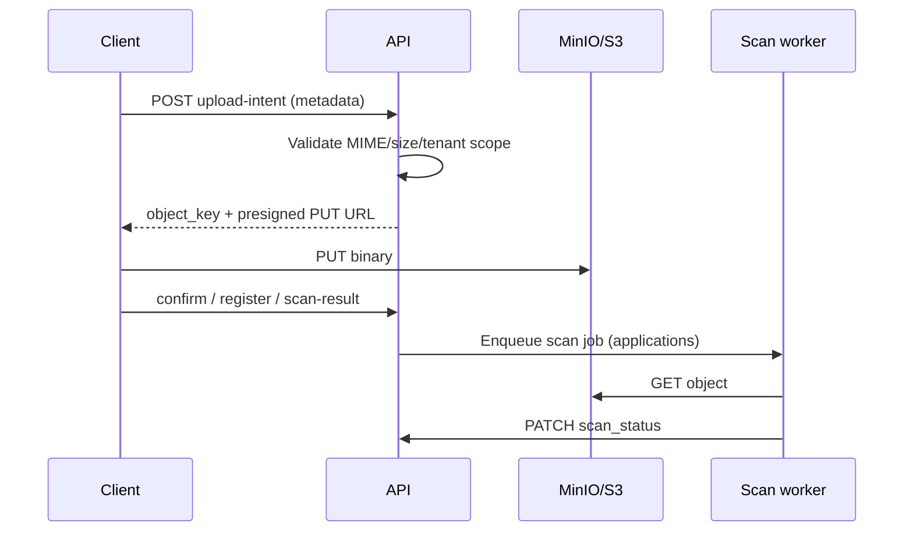

# Object Storage & Upload Programme

**Status:** **Closed — engineering** (2026-05-21). See [`master-sprint-630-exit.md`](./master-sprint-630-exit.md). Sprint exits: [`master-sprint-625-exit.md`](./master-sprint-625-exit.md) · [`master-sprint-626-exit.md`](./master-sprint-626-exit.md) · [`master-sprint-627-exit.md`](./master-sprint-627-exit.md) · [`master-sprint-628-exit.md`](./master-sprint-628-exit.md) · [`master-sprint-629-exit.md`](./master-sprint-629-exit.md).  
**Programme ID:** Master Sprints **6.25 → 6.30** (six sub-sprints).  
**Gate:** **Phase 7 KB file ingest / object-backed RAG** may proceed after **6.30** (Sahayak charter, DPA, and Phase UX **6.19** items in `ROADMAP.md` still apply for full AI rollout).

**Related:** Sprint 2.4/2.5 document contract · Phase 4 grievance `grievance_attachments` · Sprint 6.11 branding metadata · [`ARCHITECTURE.md`](../../ARCHITECTURE.md) file-upload threat model · `infrastructure/docker-compose.yml` (MinIO).

---

## 1. Problem statement

The platform has **upload contracts** (upload-intent, scan-result, register-after-upload) and **database tables** for metadata, but **binaries are not stored** and several runtimes are **simulated**:

| Surface               | Today                                                           | Gap                                               |
| --------------------- | --------------------------------------------------------------- | ------------------------------------------------- |
| Application documents | In-memory `DocumentsService` + simulated PWA/mobile file fields | No Postgres persistence, no PUT, no staff preview |
| Grievance evidence    | Prisma `grievance_attachments`; PWA real files; dev skips PUT   | Desk SVG placeholder; no mobile; no scan          |
| Branding assets       | Manual `storage_key` + `public_url` in Tenant Admin             | No upload-intent or picker                        |
| Platform              | `minio://` stub URLs; MinIO in Docker unused by API             | No shared presign/GET service                     |

Phase 7 (RAG / Sahayak) needs trustworthy file ingestion — this programme unblocks that.

---

## 2. Goals & non-goals

### Goals

| #   | Goal                                                                                                                   |
| --- | ---------------------------------------------------------------------------------------------------------------------- |
| G1  | **Single object-storage adapter** in API — tenant-prefixed keys, presigned PUT/GET, config via env                     |
| G2  | **Application documents** — metadata in `application_documents`, real binary upload, scan-gated submit (existing rule) |
| G3  | **Grievance evidence** — bytes in bucket; citizen + Desk preview; mobile parity                                        |
| G4  | **Branding assets** — upload-intent + Tenant Admin picker (logo/hero)                                                  |
| G5  | **Operator access** — Desk can open application attachments and grievance evidence                                     |
| G6  | **Security** — MIME/size limits, tenant isolation on keys, security spec fingerprints, manual smoke runbook            |

### Non-goals (this programme)

| Item                                                     | Deferred to                                                                                                  |
| -------------------------------------------------------- | ------------------------------------------------------------------------------------------------------------ |
| KB `.docx` upload + Mammoth                              | Phase **7.0** (after **6.25** platform)                                                                      |
| CDN / image transforms / thumbnails service              | Later ops sprint                                                                                             |
| ClamAV in every local dev laptop                         | Optional Docker profile; dev may use controlled auto-clean flag                                              |
| Payment receipt PDF upload                               | Payments phase                                                                                               |
| Cross-tenant asset sharing                               | Never                                                                                                        |
| Detox/Maestro full native E2E                            | Mobile manual smoke sufficient for exit                                                                      |
| Migrating **applications** off JSON store to full Prisma | Out of scope unless required for document join — prefer **sync document rows** to existing application reads |

---

## 3. Target architecture

### 3.1 Shared module (`apps/api`)

```
ObjectStorageModule
  ObjectStorageService
    - buildObjectKey(tenantCode, namespace, ...segments)
    - presignUpload(objectKey, contentType, ttlMs) → { url, headers?, expires_at }
    - presignDownload(objectKey, ttlMs) → { url, expires_at }
    - getObjectBuffer(objectKey) → Buffer   // server-side preview proxy
    - headObject(objectKey) → { size, contentType } | null
    - assertTenantPrefix(objectKey, tenantCode)
```

**Namespaces:** `applications/{applicationId}/documents/`, `grievances/evidence/`, `branding/`, (future) `kb/attachments/`.

**Config (env):**

| Variable                                   | Purpose                                          |
| ------------------------------------------ | ------------------------------------------------ |
| `OBJECT_STORAGE_ENDPOINT`                  | MinIO/S3 endpoint (dev: `http://localhost:9000`) |
| `OBJECT_STORAGE_BUCKET`                    | e.g. `enagar-local`                              |
| `OBJECT_STORAGE_ACCESS_KEY` / `SECRET_KEY` | Dev from `infrastructure/.env`                   |
| `OBJECT_STORAGE_PUBLIC_ENDPOINT`           | Optional external URL for browser PUT            |
| `OBJECT_STORAGE_FORCE_PATH_STYLE`          | `true` for MinIO                                 |
| `OBJECT_STORAGE_DISABLED`                  | `true` → legacy `minio://` stub (tests only)     |

Use **AWS SDK v3** `@aws-sdk/client-s3` + `@aws-sdk/s3-request-presigner`.

### 3.2 Upload flow (all surfaces)



### 3.3 Application documents

- **Persist** all document rows in `application_documents` (Prisma).
- **Deprecate** in-memory `DocumentsService` map; keep public API paths unchanged.
- On `GET /applications/:docket`, merge documents from Prisma (tenant + application scoped).
- **`upload_status`:** `intent_created` → `uploaded` (after successful PUT or `confirm-upload`) → `rejected` on scan fail.
- **Submit gate:** unchanged — required file fields must be `scan_status === 'clean'`.

### 3.4 Grievance evidence

- Reuse `ObjectStorageService` in `GrievancesService` (replace `signedEvidenceUrl` stub).
- **`POST …/attachments/register`** only after PUT success (or API `confirm-upload` checks `headObject`).
- Optional **lightweight scan** (same worker, lower priority) — stretch in **6.28**; minimum is size/MIME enforcement.

### 3.5 Branding

- `POST /admin/tenant/branding-assets/upload-intent` → PUT → `PATCH branding-assets` with returned `storage_key` + generated `public_url` (path-style or CDN base).

---

## 4. Sprint breakdown

| Sprint   | Name                                     | Depends on                 |
| -------- | ---------------------------------------- | -------------------------- |
| **6.25** | Platform foundation                      | —                          |
| **6.26** | Application documents (real upload + DB) | 6.25                       |
| **6.27** | Virus scan & download                    | 6.26                       |
| **6.28** | Grievance evidence E2E                   | 6.25                       |
| **6.29** | Branding + Desk document access          | 6.25, 6.26, 6.28 (partial) |
| **6.30** | Programme exit & Phase 7 gate            | 6.25–6.29                  |

---

## Sprint 6.25 — Object storage platform foundation

### Deliverables

1. **`ObjectStorageModule`** + unit tests (mock S3 client).
2. **Env wiring** in `apps/api` + `infrastructure/.env.example` documented.
3. **Docker:** MinIO bucket bootstrap (`enagar-local`) via init script or documented `mc` one-liner in runbook.
4. **Replace URL builder** in `documents.service.ts` and `grievances.service.ts` to call `presignUpload` / `presignDownload` when storage enabled.
5. **`POST /documents/:id/confirm-upload`** (optional unified) — verifies object exists via `headObject`, sets `upload_status: uploaded`.
6. **Integration spec** `object-storage.integration.spec.ts` gated by `RUN_STORAGE_TESTS=1`.

### Exit criteria

- [x] With `docker compose up minio` + env set, integration test **PUTs** a 1 KB file via presigned URL and **GETs** it back _(optional `RUN_STORAGE_TESTS=1`; bucket bootstrap via `pnpm infra:minio-cors`)_.
- [x] `pnpm --filter @enagar/api typecheck` and `pnpm test` green (storage test skipped in default CI).
- [x] `tests/security/object-storage-625.spec.ts` fingerprints module + env guards (no secrets in repo).
- [x] `ARCHITECTURE.md`, `apps/api/README.md`, `ROADMAP.md`, and this programme doc updated for 6.25.

### Manual smoke

1. `curl` presigned PUT from upload-intent response (documented in sprint exit doc).
2. MinIO console (`:9001`) shows object under `tenants/{code}/...`.

---

## Sprint 6.26 — Application documents (persistence + real client upload)

### Deliverables

1. **Prisma repository** for `application_documents` — create on upload-intent, update on confirm/scan.
2. **Remove** in-memory `Map` from `DocumentsService`; migrate tests to Prisma test DB or repository mock.
3. **`ApplicationsService.attachDocument`** writes through Prisma (or sync layer) so docket detail lists documents.
4. **`@enagar/forms/web`** — real `<input type="file">` for `file-picker` (web): capture `File`, compute `size_mb`, sniff MIME from browser.
5. **`@enagar/forms/native`** (or mobile field renderer) — `expo-document-picker` / image picker for file fields.
6. **Citizen PWA `page.tsx`** — after intent: **PUT** file, then `confirm-upload` or scan; remove filename-only simulation.
7. **Mobile `documentsApi.ts`** — same PUT path.
8. **Failure UX** — banner when PUT fails; do not mark scan-clean without upload.

### Exit criteria

- [ ] End-to-end: Birth Certificate (or any seeded service with file field) — draft → **real PDF/image** upload → submit succeeds.
- [ ] Row exists in `application_documents` with `object_key` matching bucket object.
- [ ] Restart API — document metadata **survives** (proves not in-memory).
- [ ] `phase2-api.integration.spec.ts` updated for confirm-upload path.
- [ ] `tests/security/master-sprint-626.spec.ts` — no simulated file-picker string in citizen apply path (contract).

### Manual smoke (PWA `:3000`)

1. OTP login → apply service with required document → pick real file → submit.
2. Application detail shows document `upload_status` / `scan_status` **clean**.
3. MinIO object present at `object_key`.

---

## Sprint 6.27 — Virus scan pipeline & citizen download

### Deliverables

1. **`document_scan_jobs`** table (or reuse `scan_status` + queue id on `application_documents`) — `pending | processing | clean | infected | failed`.
2. **Worker** `services/document-scan-worker` (BullMQ): fetch object → ClamAV (`clamd`) OR dev stub (`DOCUMENT_SCAN_STUB=clean`).
3. **Docker Compose profile `clamav`** — optional; documented in runbook.
4. **API:** remove client-trusted `scan-result` in **production** config; keep **dev-only** `ALLOW_CLIENT_SCAN_SIMULATION=true` for local speed.
5. **`GET /documents/:id/download`** returns presigned GET only when `scan_status === 'clean'` and object exists.
6. **Citizen PWA** — “Download document” on application detail when clean.
7. **Rate limits** — max intents per application per hour (basic in-memory or Redis if available).

### Exit criteria

- [ ] Upload without scan completion → **submit blocked** with existing error message.
- [ ] Worker marks infected file → submit blocked; `upload_status: rejected`.
- [ ] `pnpm test:security` includes scan-worker contract spec.
- [ ] Default CI passes without ClamAV container.

### Manual smoke

1. Upload EICAR test string file (in dev stub mode: expect `infected` or blocked).
2. Clean file → submit → download opens in browser.

---

## Sprint 6.28 — Grievance evidence end-to-end

### Deliverables

1. Wire **grievance evidence upload-intent** to `ObjectStorageService`.
2. **Register guard** — `headObject` must succeed before `attachments/register`.
3. **Remove** `minio://` skip in `citizen-pwa/lib/grievance-evidence.ts` when storage enabled.
4. **`getDeskGrievanceAttachmentBlob`** — stream bytes from MinIO (images + video/mp4 with range optional).
5. **Citizen API** `GET /grievances/:id/attachments/:attachmentId/blob` (citizen-scoped, same as getById).
6. **Citizen PWA** — thumbnail/preview on grievance detail (not only storage keys).
7. **Mobile** — `GrievanceComposerScreen`: image picker (max 3), location optional (stretch: map), upload after create using shared helper package `@enagar/upload-client` (optional thin shared lib).
8. **i18n** keys for mobile evidence errors.

### Exit criteria

- [ ] PWA: file grievance with photo → Desk shows **real image** (not SVG placeholder).
- [ ] Mobile: same grievance visible on Desk with attachment.
- [ ] `grievances.db.spec.ts` covers register-after-upload with storage mock or `RUN_STORAGE_TESTS=1`.
- [ ] Video evidence: Desk plays or offers download link (no 404 “local dev” message when storage on).

### Manual smoke

1. Citizen PWA — photo + GPS → Tenant Desk **:3002** — evidence grid shows image.
2. Mobile composer — one photo — appears on Desk.

---

## Sprint 6.29 — Branding upload & Desk application documents

### Deliverables

1. **`POST /admin/tenant/branding-assets/upload-intent`** — logo/hero MIME whitelist, 5 MB cap.
2. **Tenant Admin Operations** — file picker replaces manual storage_key entry; preview after upload.
3. **`public_url`** derived from `OBJECT_STORAGE_PUBLIC_BASE` + key (or MinIO public bucket policy in dev).
4. **Desk application detail** — list `application_documents` with preview (PDF iframe / image) + download for `tenant_clerk` / desk roles.
5. **Contrast check** (existing) runs on registered asset metadata.

### Exit criteria

- [ ] KMC admin uploads new logo PNG through UI; hub/PWA theme shows new logo URL.
- [ ] Desk operator opens application with attachment — inline preview works.
- [ ] `tests/security/master-sprint-629.spec.ts` — branding upload-intent tenant-prefix enforcement.

### Manual smoke

1. Operations → branding → upload hero image → save settings.
2. Desk → application with birth certificate scan → view attachment.

---

## Sprint 6.30 — Programme exit & Phase 7 gate

### Deliverables

1. **`master-sprint-630-exit.md`** — verification commands + sign-off table.
2. **`tests/security/object-storage-programme.spec.ts`** — cross-cutting contracts (intent, prefix, no path traversal).
3. Update **`ROADMAP.md`** locked queue row **6.25–6.30**; Phase 7 note: “requires 6.30”.
4. Update **`docs/reference/enagar-database-system-admin.md`** — storage flows, `application_documents` runtime, scan jobs.
5. **`apps/api/README.md`**, **`citizen-pwa/README.md`**, **`mobile/README.md`** — real upload smoke steps.
6. **`graphify update .`**
7. Programme status → **Closed — engineering** in this file.

### Programme exit criteria

- [ ] All sprint exit checklists **6.25–6.29** checked.
- [ ] `pnpm lint && pnpm typecheck && pnpm test && pnpm test:security` green.
- [ ] Manual smoke script (below) passed on **KMC** dummy tenant.
- [ ] No production code path relies on **client-declared clean scan** without `ALLOW_CLIENT_SCAN_SIMULATION`.
- [ ] Sponsor optional sign-off on exit doc.

### End-to-end manual smoke (programme)

| #   | Step                                          | Port              |
| --- | --------------------------------------------- | ----------------- |
| 1   | Apply service with PDF upload                 | PWA `:3000`       |
| 2   | Desk view application attachment              | Tenant `:3002`    |
| 3   | File grievance with photo + map pin           | PWA `:3000`       |
| 4   | Desk view grievance evidence                  | `:3002`           |
| 5   | Upload branding logo                          | Tenant Operations |
| 6   | Mobile grievance with photo (if 6.28 shipped) | Expo              |

---

## 5. Testing strategy

| Layer           | What                                                             |
| --------------- | ---------------------------------------------------------------- |
| Unit            | `ObjectStorageService` key builder, prefix asserts, MIME maps    |
| API integration | Upload-intent → PUT → confirm → download (`RUN_STORAGE_TESTS=1`) |
| DB              | `application_documents` + `grievance_attachments` CRUD with RLS  |
| Security        | Fingerprint specs per sprint (`master-sprint-62x.spec.ts`)       |
| Manual          | Per-sprint smoke above                                           |

**CI default:** storage integration **skipped**; contract tests always run.

---

## 6. Risks & mitigations

| Risk                                                        | Mitigation                                                                                 |
| ----------------------------------------------------------- | ------------------------------------------------------------------------------------------ |
| Applications still on JSON store — document join complexity | Read documents by `application_id` UUID; do not block on full application Prisma migration |
| ClamAV slows local dev                                      | `DOCUMENT_SCAN_STUB` + optional compose profile                                            |
| CORS on MinIO PUT from browser                              | `OBJECT_STORAGE_PUBLIC_ENDPOINT` + bucket CORS policy in init script                       |
| Large video grievance uploads                               | Keep 25 MB cap; Desk stream with range headers in 6.28                                     |
| Mobile picker parity delays 6.28                            | Split: PWA+Desk required for exit; mobile marked required in 6.28 exit criteria            |

---

## 7. Phase 7 handoff (after 6.30)

| Phase 7 item      | Uses                                                       |
| ----------------- | ---------------------------------------------------------- |
| KB `.docx` upload | `ObjectStorageService` namespace `kb/`                     |
| RAG indexer       | Fetch published objects from storage keys on `kb_articles` |
| Chat attachments  | Same presign pattern (future sprint)                       |

---

## 8. Document index (create per sprint)

| Sprint | Plan                        | Exit                        |
| ------ | --------------------------- | --------------------------- |
| 6.25   | `master-sprint-625-plan.md` | `master-sprint-625-exit.md` |
| 6.26   | `master-sprint-626-plan.md` | `master-sprint-626-exit.md` |
| 6.27   | `master-sprint-627-plan.md` | `master-sprint-627-exit.md` |
| 6.28   | `master-sprint-628-plan.md` | `master-sprint-628-exit.md` |
| 6.29   | `master-sprint-629-plan.md` | `master-sprint-629-exit.md` |
| 6.30   | —                           | `master-sprint-630-exit.md` |

---

## 9. Estimated duration (guidance)

| Sprint | Engineering focus | Suggested calendar |
| ------ | ----------------- | ------------------ |
| 6.25   | 3–5 days          | Week 1             |
| 6.26   | 5–7 days          | Week 2             |
| 6.27   | 4–6 days          | Week 3             |
| 6.28   | 5–7 days          | Week 4             |
| 6.29   | 3–5 days          | Week 5             |
| 6.30   | 2–3 days          | Week 5–6           |

**Total:** ~6 weeks engineering time (parallel QA smoke each sprint).

---

## 10. Locked queue snippet (for `ROADMAP.md`)

Add after Sprint 6.24 when work starts:

| ID   | Sprint                            | Gate                  |
| ---- | --------------------------------- | --------------------- |
| 6.25 | Object storage platform           | Phase 7 blocked       |
| 6.26 | Application documents real upload | ↑                     |
| 6.27 | ClamAV / scan worker              | ↑                     |
| 6.28 | Grievance evidence E2E            | ↑                     |
| 6.29 | Branding + Desk docs              | ↑                     |
| 6.30 | Programme exit                    | **Phase 7 unblocked** |
