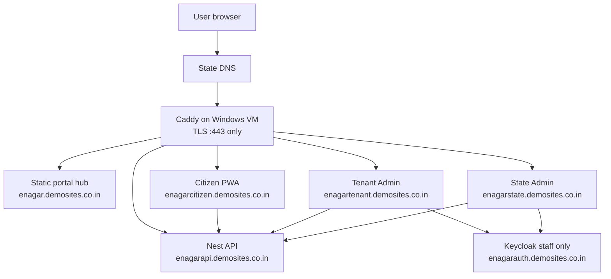
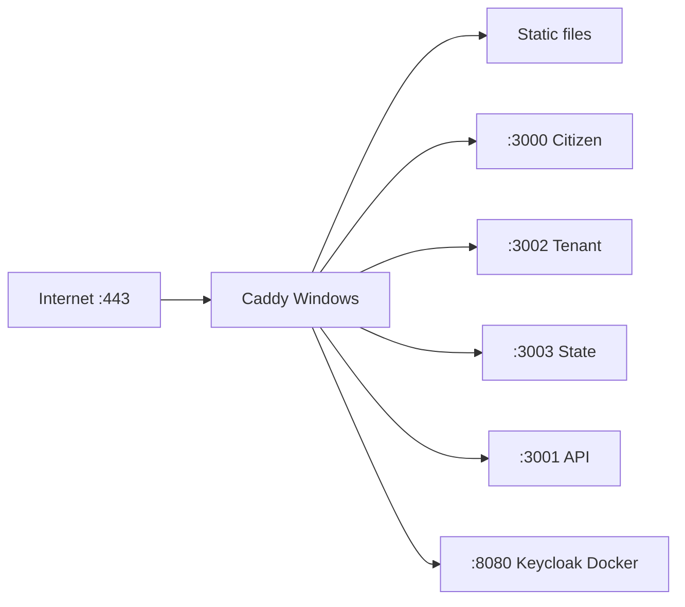

# Unified portal — Option A implementation plan

**Status:** Phases 1–7 repo deliverables complete — **VM cutover pending** (`demosites.co.in` on single Azure Windows VM).  
**Decision:** Static landing on apex; each portal on its own subdomain.  
**Rejected:** Option B (single domain + path prefixes `/citizen`, `/tenant`, `/state`).

**First deployment target:** Single **Azure Windows VM**, Docker for infra only (no Kubernetes). **Caddy** as reverse proxy; wildcard TLS `*.demosites.co.in`. See **§13**.

**Scope:** Portal hub + reverse-proxy routing + env/Keycloak/CORS alignment for Citizen PWA, Tenant Admin, State Admin, and API.  
**Out of scope (later lane):** Per-ULB citizen subdomains (`kmc.enagar.gov.in`) — see §9; K8s Ingress until Helm Phase 10.

Related: [ADR-0005 hosting on-prem](../ADRs/ADR-0005-hosting-onprem.md), [design-system §3 multi-tenant theming](../design-system.md), [start-the-app-step-by-step](../help/start-the-app-step-by-step.md).

---

## 1. Target architecture



### Canonical subdomain map — demo/staging (`demosites.co.in`)

| Host                            | Service                          | VM upstream (localhost) | Local dev (your machine) |
| ------------------------------- | -------------------------------- | ----------------------- | ------------------------ |
| `enagar.demosites.co.in`        | **Portal hub** (static HTML/CSS) | Caddy `file_server`     | _new — optional_         |
| `enagarcitizen.demosites.co.in` | Citizen PWA                      | `:3000`                 | `http://localhost:3000`  |
| `enagartenant.demosites.co.in`  | Tenant Admin                     | `:3002`                 | `http://localhost:3002`  |
| `enagarstate.demosites.co.in`   | State Admin                      | `:3003`                 | `http://localhost:3003`  |
| `enagarapi.demosites.co.in`     | Nest API                         | `:3001`                 | `http://localhost:3001`  |
| `enagarauth.demosites.co.in`    | Keycloak (**staff only**)        | Docker `:8080`          | `http://localhost:8080`  |

**DNS (confirmed):** All six A records → **static** VM public IP. You manage `demosites.co.in`.

**Auth visibility:** `enagarauth` is **not** linked from the hub. Citizens use OTP on the citizen subdomain; only Tenant/State staff hit Keycloak in the browser.

**Future production naming** (when moving off demo): `citizen.enagar.gov.in`, `tenant.`, etc. — same pattern, different zone.

**MinIO:** Internal Docker only — **no** public subdomain. Presigned URLs stay on `127.0.0.1:9000` from the VM; browser CORS must allow `https://enagarcitizen.demosites.co.in`.

---

## 2. Why Option A fits this repo

| Benefit                      | For eNagarSeba                                                        |
| ---------------------------- | --------------------------------------------------------------------- |
| **No app rewrites**          | Keep root `/login`, `/dashboard`, `/_next/*` as today — no `basePath` |
| **Clean Keycloak**           | One redirect URI per client: `https://tenant.enagar.gov.in/*`         |
| **Session isolation**        | Citizen OTP vs staff Keycloak on different origins                    |
| **Matches ADR-0005**         | Ingress routes host → Service; Helm-ready                             |
| **Matches design-system §3** | Subdomain → tenant theming is a **future** citizen entry pattern      |
| **Simple CORS**              | Explicit origins in API (citizen + tenant + state + mobile web)       |

**Trade-off vs Option B:** Four (or five) DNS records and TLS SANs instead of one hostname — acceptable for government ops.

---

## 3. What changes vs today

| Layer         | Change                                                                                   |
| ------------- | ---------------------------------------------------------------------------------------- |
| **New**       | Static portal hub (HTML/CSS or tiny static site package)                                 |
| **New**       | Caddy vhost config on Windows VM (`infrastructure/ingress/`) — K8s Ingress stub deferred |
| **Per app**   | Production `NEXT_PUBLIC_*` URLs only (build-time) — **no routing code**                  |
| **API**       | `CORS_ORIGIN` comma list of prod subdomains                                              |
| **Keycloak**  | `realm-export.json` redirect + web origin URIs                                           |
| **MinIO**     | CORS allowed origins include citizen subdomain                                           |
| **Docs**      | ADR (when accepted), this runbook, exit checklist, update start guide                    |
| **Unchanged** | Monorepo app structure, OTP flow, API paths, Prisma, docker-compose infra                |

---

## 4. Phased deliverables

### Phase 0 — Architecture freeze (~1 week)

| ID   | Deliverable                                                                             |
| ---- | --------------------------------------------------------------------------------------- |
| D0.1 | `docs/ADRs/ADR-0011-unified-portal-subdomains.md` — Option A accepted; rejects Option B |
| D0.2 | This runbook (living document)                                                          |
| D0.3 | DNS & TLS matrix — hostnames, cert SANs, state DNS owner                                |
| D0.4 | Build-time env matrix — see §5                                                          |
| D0.5 | Risk register — Keycloak drift, cert expiry, hub stale links                            |

**Exit criteria (Phase 0)**

- [x] Subdomain names signed off — `demosites.co.in` table in §1
- [ ] ADR status = Accepted
- [x] Hub on apex `enagar.demosites.co.in` (no separate `www` record)
- [x] Keycloak public URL `enagarauth.demosites.co.in` — staff only

---

### Phase 1 — Portal hub static site (~1 week)

| ID   | Deliverable                  | Description                                                             |
| ---- | ---------------------------- | ----------------------------------------------------------------------- |
| D1.1 | `infrastructure/portal-hub/` | Static site: Tricolor Calm / DM Sans, three portal cards                |
| D1.2 | Hub content                  | Citizen / Municipal staff / State administration + “which portal?” copy |
| D1.3 | Env-driven links             | Dev → localhost ports; prod → subdomains                                |
| D1.4 | Accessibility                | Focus order, contrast, keyboard nav, `lang`                             |
| D1.5 | Optional                     | Maintenance banner slot (static JSON or env at deploy)                  |

**Hub links (demo/staging)**

- Citizen → `https://enagarcitizen.demosites.co.in`
- Municipal staff → `https://enagartenant.demosites.co.in/login`
- State → `https://enagarstate.demosites.co.in/login`
- **No** link to `enagarauth` (staff reach it via admin login redirect only)

**Exit criteria (Phase 1)**

- [x] Hub static site in `infrastructure/portal-hub/` (Tricolor Calm, DM Sans, three cards)
- [ ] Hub renders at 320px and 1280px width (manual / Lighthouse)
- [ ] All three links open correct hosts (manual)
- [x] No secrets in static assets
- [ ] Lighthouse ≥ 90 Performance, ≥ 95 Accessibility
- [x] Brand aligned with `docs/design-system.md` (no emoji icons)

---

### Phase 2 — Caddy reverse proxy on Windows VM (~1 week)

| ID   | Deliverable                                                               |
| ---- | ------------------------------------------------------------------------- |
| D2.1 | `infrastructure/ingress/Caddyfile.demosites` — vhost → localhost upstream |
| D2.2 | K8s Ingress manifest stub (**deferred** until Helm Phase 10)              |
| D2.3 | NSG + Windows Firewall checklist — **443 only** public; block app ports   |
| D2.4 | Health checks documented (`enagarapi` host)                               |
| D2.5 | Caddy install + wildcard cert paths documented for VM                     |

**Routing rules (demo VM)**

| Host                            | Upstream                   |
| ------------------------------- | -------------------------- |
| `enagar.demosites.co.in`        | Static hub (`file_server`) |
| `enagarcitizen.demosites.co.in` | Citizen PWA `:3000`        |
| `enagartenant.demosites.co.in`  | Tenant Admin `:3002`       |
| `enagarstate.demosites.co.in`   | State Admin `:3003`        |
| `enagarapi.demosites.co.in`     | API `:3001`                |
| `enagarauth.demosites.co.in`    | Keycloak Docker `:8080`    |

**TLS:** Existing wildcard `*.demosites.co.in` cert (not Let’s Encrypt for this demo). HTTPS only; Caddy redirects `:80` → `:443`.

**Exit criteria (Phase 2)**

- [ ] Each vhost returns 200 for `/` (or `/login` for admin) through ingress
- [ ] TLS at ingress; `X-Forwarded-*` correct
- [ ] `/_next/static/*` loads on all three Next apps
- [ ] Hub only on www/apex — not proxied to Next apps on www
- [ ] Runbook: how to add a new vhost

---

### Phase 3 — Production build & env pipeline (~1 week)

Each app gets **environment-specific builds** (CI), not runtime URL detection.

| App              | Build-time variables (prod example)                                                |
| ---------------- | ---------------------------------------------------------------------------------- |
| **Citizen PWA**  | `NEXT_PUBLIC_API_BASE_URL=https://enagarapi.demosites.co.in/api`                   |
|                  | `NEXT_PUBLIC_ALLOW_CLIENT_SCAN_SIMULATION=true` _(demo VM)_                        |
| **Tenant Admin** | `NEXT_PUBLIC_API_BASE_URL=https://enagarapi.demosites.co.in/api`                   |
|                  | `NEXT_PUBLIC_ADMIN_APP_ORIGIN=https://enagartenant.demosites.co.in`                |
|                  | `NEXT_PUBLIC_KEYCLOAK_ISSUER_URL=https://enagarauth.demosites.co.in/realms/enagar` |
| **State Admin**  | Same with `NEXT_PUBLIC_STATE_APP_ORIGIN=https://enagarstate.demosites.co.in`       |
| **Portal hub**   | `PORTAL_CITIZEN_URL`, `PORTAL_TENANT_URL`, `PORTAL_STATE_URL`                      |

| ID   | Deliverable                                                                                                                       |
| ---- | --------------------------------------------------------------------------------------------------------------------------------- |
| D3.1 | Updated `.env.example` + `.env.production.example` per app — see [`unified-portal-env-matrix.md`](./unified-portal-env-matrix.md) |
| D3.2 | CI job `portal-demo-build` + `pnpm build:portal-demo`                                                                             |
| D3.3 | `infrastructure/.env.example` + `.env.production.example` prod `CORS_ORIGIN` template                                             |

**Exit criteria (Phase 3)**

- [x] Env matrix doc — [`unified-portal-env-matrix.md`](./unified-portal-env-matrix.md) + `demo-hosts.json`
- [x] `.env.production.example` for citizen, tenant, state, infrastructure
- [x] CI: `portal-demo-build` embeds demo subdomains in client bundles
- [x] CI: [`unified-portal-env-matrix.spec.ts`](../../tests/security/unified-portal-env-matrix.spec.ts)
- [ ] Citizen calls `api.` without CORS errors (VM smoke — Phase 5 + cutover)

---

### Phase 4 — Keycloak alignment (~3–5 days)

| ID   | Deliverable                                                                                      |
| ---- | ------------------------------------------------------------------------------------------------ |
| D4.1 | Update `infrastructure/keycloak/realm-export.json`                                               |
| D4.2 | Redirect URIs: `https://enagartenant.demosites.co.in/*`, `https://enagarstate.demosites.co.in/*` |
| D4.3 | Web origins: exact subdomain origins                                                             |
| D4.4 | Post-logout redirect → `{origin}/login`                                                          |
| D4.5 | Re-import runbook — [`unified-portal-keycloak-phase4.md`](./unified-portal-keycloak-phase4.md)   |
| D4.6 | Keep dev URIs (`localhost:3002`, `:3003`) during transition                                      |

**Exit criteria (Phase 4)**

- [x] `realm-export.json` — demo redirect/web origins + post-logout URIs (localhost retained)
- [x] CI: [`unified-portal-keycloak.spec.ts`](../../tests/security/unified-portal-keycloak.spec.ts)
- [x] Re-import runbook: [`unified-portal-keycloak-phase4.md`](./unified-portal-keycloak-phase4.md)
- [x] Tenant Admin Keycloak logout route (`/api/admin-auth/logout`)
- [ ] Tenant Admin: PKCE login → dashboard/Desk on tenant subdomain (VM smoke)
- [ ] State Admin: login on state subdomain (VM smoke)
- [ ] Logout → `/login` on same subdomain (VM smoke)

---

### Phase 5 — API, CORS & object storage (~3–5 days)

| ID   | Deliverable                                                                                                       |
| ---- | ----------------------------------------------------------------------------------------------------------------- |
| D5.1 | `CORS_ORIGIN` prod: citizen + tenant + state — [`unified-portal-cors-phase5.md`](./unified-portal-cors-phase5.md) |
| D5.2 | `configure-minio-cors.mjs` + `MINIO_API_CORS_ALLOW_ORIGIN` — all portal HTTPS origins                             |
| D5.3 | Document upload pilot — stub storage + scan simulation for external demo                                          |
| D5.4 | Demo VM: `ALLOW_CLIENT_SCAN_SIMULATION=true`; worker optional (documented)                                        |

**Exit criteria (Phase 5)**

- [x] API + MinIO CORS templates and shared `cors-origins.mjs`
- [x] CI: [`unified-portal-cors.spec.ts`](../../tests/security/unified-portal-cors.spec.ts)
- [x] Phase 5 runbook — scan simulation pilot + full MinIO path documented
- [ ] No CORS errors on citizen apply, grievance, admin Desk (VM smoke)
- [ ] MinIO PUT from citizen subdomain (VM — after storage proxy, or stub pilot on VM)

---

### Phase 6 — Local development story (~2–3 days)

**Principle:** Daily dev unchanged — `pnpm dev:portals` on `:3000/:3002/:3003/:3001`. Hub optional.

| ID   | Deliverable                                                                                                       |
| ---- | ----------------------------------------------------------------------------------------------------------------- |
| D6.1 | Update [`start-the-app-step-by-step.md`](../help/start-the-app-step-by-step.md) — portal hub (optional)           |
| D6.2 | Local hub linking to localhost ports — `config.js` + `pnpm dev:hub`                                               |
| D6.3 | Optional `*.enagar.local` hosts — [`unified-portal-local-dev-phase6.md`](./unified-portal-local-dev-phase6.md) §3 |
| D6.4 | Document prod URLs are build-time only — start guide + env matrix                                                 |

**Exit criteria (Phase 6)**

- [x] Start guide: hub OR direct ports (`dev:portals` + optional `dev:hub`)
- [x] Hub dev links match `dev:portals` ports (CI: `unified-portal-local-dev.spec.ts`)
- [x] Phase 6 runbook — no ingress for feature dev; optional hosts recipe
- [x] Build-time prod URLs documented

---

### Phase 7 — Testing & verification (~1 week)

| ID   | Deliverable                                                                                            |
| ---- | ------------------------------------------------------------------------------------------------------ |
| D7.1 | Master checklist — [`unified-portal-option-a-exit.md`](./unified-portal-option-a-exit.md)              |
| D7.2 | Manual QA — [`unified-portal-manual-qa.md`](./unified-portal-manual-qa.md)                             |
| D7.3 | Hub static contract — [`unified-portal-hub.spec.ts`](../../tests/security/unified-portal-hub.spec.ts)  |
| D7.4 | Security review — [`unified-portal-security-review.md`](./unified-portal-security-review.md)           |
| D7.5 | **Beginner VM guide** — [`unified-portal-vm-setup-beginner.md`](./unified-portal-vm-setup-beginner.md) |

**Exit criteria (Phase 7)**

- [x] VM setup guide (beginner language)
- [x] Manual QA script (A-01–A-10)
- [x] Exit checklist + pre-flight CI steps
- [x] Security review doc (TLS, CORS, cookies, exposure)
- [x] CI: hub + Phase 7 package specs
- [ ] All §6 master exit criteria pass on VM (`demosites.co.in` smoke)

---

## 5. Environment matrix

### Demo/staging VM (`demosites.co.in`) — confirmed

| Setting                      | Value                                                                                                            |
| ---------------------------- | ---------------------------------------------------------------------------------------------------------------- |
| Hub                          | `https://enagar.demosites.co.in`                                                                                 |
| Citizen                      | `https://enagarcitizen.demosites.co.in`                                                                          |
| Tenant                       | `https://enagartenant.demosites.co.in`                                                                           |
| State                        | `https://enagarstate.demosites.co.in`                                                                            |
| API                          | `https://enagarapi.demosites.co.in/api`                                                                          |
| Keycloak issuer              | `https://enagarauth.demosites.co.in/realms/enagar`                                                               |
| CORS (`infrastructure/.env`) | `https://enagarcitizen.demosites.co.in,https://enagartenant.demosites.co.in,https://enagarstate.demosites.co.in` |
| Scan simulation              | `ALLOW_CLIENT_SCAN_SIMULATION=true` (API + PWA)                                                                  |
| MinIO                        | Internal `127.0.0.1:9000`; CORS includes citizen HTTPS origin                                                    |
| Public ports                 | **443 only** (80 → redirect); block 3000–3003, 8080, 5432, 6379, 9000 from internet                              |

**VM app mode (current):** `pnpm dev` on localhost ports — sufficient for routing smoke; **production builds** required before staff OAuth and citizen HTTPS flows are fully stable through Caddy.

**Auto-start on reboot:** Not required for this demo phase.

### Local (unchanged)

| App            | URL                                |
| -------------- | ---------------------------------- |
| Hub (optional) | static file or local static server |
| Citizen        | `http://localhost:3000`            |
| Tenant         | `http://localhost:3002`            |
| State          | `http://localhost:3003`            |
| API            | `http://localhost:3001/api`        |
| Keycloak       | `http://localhost:8080`            |

---

## 6. Master exit criteria (release gate)

All must pass on **staging** before production DNS cutover:

| #   | Criterion                                                  |
| --- | ---------------------------------------------------------- |
| E1  | Hub at www loads; three portal links correct               |
| E2  | Apex redirects to www (if using both)                      |
| E3  | Citizen: OTP login, pin ULB, apply service, DB `submitted` |
| E4  | Tenant: Keycloak login, Desk inbox, open application       |
| E5  | State: Keycloak login, grievance library loads             |
| E6  | Logout → `/login` on same subdomain                        |
| E7  | Hard refresh on deep routes — no 404                       |
| E8  | `/_next/static/*` on each subdomain                        |
| E9  | API health via `api.` host                                 |
| E10 | No CORS console errors                                     |
| E11 | Citizen document upload + submit (prod scan policy)        |
| E12 | TLS / HSTS per state policy                                |
| E13 | OAuth cancel → error on `{subdomain}/login`                |
| E14 | Hub maintenance banner procedure tested once               |

---

## 7. Test matrix

### Manual smoke

| ID   | Flow                            | Pass condition                 |
| ---- | ------------------------------- | ------------------------------ |
| A-01 | Hub → Citizen                   | Lands on citizen host `/`      |
| A-02 | Hub → Tenant                    | Lands on `/login`              |
| A-03 | Hub → State                     | Lands on `/login`              |
| A-04 | Citizen OTP → hub → workspace   | Session survives refresh       |
| A-05 | Citizen apply + file upload     | Docket + DB                    |
| A-06 | Tenant clerk → Desk             | Scoped list loads              |
| A-07 | Tenant admin → Configure        | Designer opens                 |
| A-08 | State admin → Grievance library | Catalogue loads                |
| A-09 | OAuth cancel                    | Error on tenant/state `/login` |
| A-10 | Mobile viewport hub + citizen   | Usable layout                  |

### Automated (recommended on staging)

| Suite         | Scope                                       |
| ------------- | ------------------------------------------- |
| Hub link test | HTTP 200; href hosts match matrix           |
| Citizen smoke | Playwright with staging `citizen.` base URL |
| Tenant smoke  | Login page loads; API health                |
| TLS smoke     | Cert expiry > 30 days (ops alert)           |

### Regression

- `pnpm --filter @enagar/citizen-pwa test`
- `pnpm --filter @enagar/api test`
- Existing tenant isolation / security specs

---

## 8. Risks & mitigations

| Risk                                    | Mitigation                                          |
| --------------------------------------- | --------------------------------------------------- |
| Hub links wrong env after deploy        | Build-time env; CI grep for `localhost` in prod hub |
| Keycloak realm drift                    | realm-export source of truth; CI compare            |
| DNS / TLS delay from state IT           | Start in Phase 0; staging first                     |
| CORS misconfiguration                   | Phase 5 checklist + browser smoke                   |
| Dev vs prod URL confusion               | Keep localhost dev; document build-time prod URLs   |
| PWA service worker on citizen subdomain | Test install from `https://citizen.`                |
| Stale hub after URL change              | Version hub with release; release checklist         |

---

## 9. Future lane (not in this programme)

| Item                                             | Notes                                                   |
| ------------------------------------------------ | ------------------------------------------------------- |
| Per-ULB citizen subdomains (`kmc.enagar.gov.in`) | design-system §3; edge tenant resolver + DNS automation |
| Helm charts Phase 10                             | Ingress from Phase 2 → Helm                             |
| Mobile deep links                                | Custom scheme; hub may link app stores later            |
| Option B path routing                            | Rejected — see ADR-0011 when written                    |

---

## 10. Suggested timeline

| Phase         | Duration  | Can start after     |
| ------------- | --------- | ------------------- |
| 0 ADR + DNS   | 1 week    | —                   |
| 1 Hub         | 1 week    | 0                   |
| 2 Ingress     | 1–2 weeks | 0 (parallel with 1) |
| 3 Build/env   | 1 week    | 0                   |
| 4 Keycloak    | 3–5 days  | 2 (staging ingress) |
| 5 CORS/MinIO  | 3–5 days  | 2, 3                |
| 6 Local docs  | 2–3 days  | 1                   |
| 7 Test & exit | 1 week    | 1–6                 |

**Total:** ~4–5 weeks calendar (Phases 1–3 parallelizable).

---

## 11. Rollback

- DNS: point subdomains to previous targets or disable ingress rules.
- Apps: redeploy previous builds (keep CI artifacts).
- Hub: revert static deployment.
- **No database migrations** in this programme.

---

## 12. Recommended next actions

1. ~~Approve subdomain names~~ — done (`demosites.co.in` table §1).
2. Verify **Azure NSG + Windows Firewall** — inbound **443** (and **80** redirect) only; see §13.3.
3. Install **Caddy** on VM; deploy `infrastructure/ingress/Caddyfile.demosites`.
4. Build **portal hub** static site (Phase 1) → serve from Caddy `file_server`.
5. Update **`infrastructure/.env`** on VM: `CORS_ORIGIN`, `KEYCLOAK_ISSUER_URL`, scan simulation.
6. Update **Keycloak realm** redirect/web origins; re-import or patch live realm.
7. **Production builds** on VM with §5 env matrix; smoke per [exit checklist](./unified-portal-option-a-exit.md).
8. Author **ADR-0011** when ready to mark programme Accepted.

---

## 13. Demo deployment — single Azure Windows VM

**Profile:** Docker Compose for infra (Postgres, Redis, MinIO, Keycloak, …). Node apps on **host** localhost. **Caddy** terminates TLS. **No Kubernetes.** Dev machine ≠ VM.

### 13.1 Traffic flow



### 13.2 Caddy (preferred over IIS for this programme)

IIS is present on the VM but **Caddy** is the chosen edge proxy — simpler vhost config and consistent `X-Forwarded-*` headers.

**Install (VM):** [Caddy on Windows](https://caddyserver.com/docs/install#windows) — e.g. `winget install Caddy.Caddy` or download binary + install as Windows Service.

**Wildcard cert:** You already have `*.demosites.co.in`. Place PEM + key on the VM (e.g. `C:\enagar\certs\demosites.co.in.pem` + `.key`). Reference both paths in every site block.

**Template:** `infrastructure/ingress/Caddyfile.demosites` (create in Phase 2):

```caddyfile
(tls_demo) {
	tls C:\enagar\certs\demosites.co.in.pem C:\enagar\certs\demosites.co.in.key
}

enagar.demosites.co.in {
	import tls_demo
	root * C:\enagar\portal-hub
	file_server
	encode gzip
}

enagarcitizen.demosites.co.in {
	import tls_demo
	reverse_proxy localhost:3000
}

enagartenant.demosites.co.in {
	import tls_demo
	reverse_proxy localhost:3002
}

enagarstate.demosites.co.in {
	import tls_demo
	reverse_proxy localhost:3003
}

enagarapi.demosites.co.in {
	import tls_demo
	reverse_proxy localhost:3001
}

enagarauth.demosites.co.in {
	import tls_demo
	reverse_proxy localhost:8080
}
```

**Run:** `caddy run --config C:\enagar\Caddyfile` or install as a service pointing at that config.

**Static hub:** Plain HTML/CSS in `C:\enagar\portal-hub\index.html` — no Node process. Caddy serves it directly (fast, easy to update).

### 13.3 Firewall & NSG (verify — status unknown)

Only **443** should reach apps from the internet. **80** optional for HTTP→HTTPS redirect.

| Check                                 | Azure NSG  | Windows Firewall |
| ------------------------------------- | ---------- | ---------------- |
| Allow inbound **443**                 | ✓ required | ✓ required       |
| Allow inbound **80** (redirect)       | optional   | optional         |
| **Deny** 3000, 3001, 3002, 3003       | ✓          | ✓                |
| **Deny** 8080, 5432, 6379, 9000, 9001 | ✓          | ✓                |

**Quick test from outside the VM:**

```powershell
# Should succeed
curl -I https://enagarapi.demosites.co.in/health

# Should fail / timeout (not publicly reachable)
curl -I http://<vm-public-ip>:3000
```

### 13.4 VM `infrastructure/.env` overrides (demo)

Keep Docker-internal URLs for Postgres/Redis/MinIO. Change **public-facing** settings only:

```env
CORS_ORIGIN=https://enagarcitizen.demosites.co.in,https://enagartenant.demosites.co.in,https://enagarstate.demosites.co.in
ALLOW_CLIENT_SCAN_SIMULATION=true
KEYCLOAK_ISSUER_URL=https://enagarauth.demosites.co.in/realms/enagar
KEYCLOAK_TOKEN_ENDPOINT=https://enagarauth.demosites.co.in/realms/enagar/protocol/openid-connect/token
KEYCLOAK_LOGOUT_ENDPOINT=https://enagarauth.demosites.co.in/realms/enagar/protocol/openid-connect/logout
```

**Keycloak container:** For staff login through `enagarauth`, set hostname/proxy env when moving off pure localhost (Phase 4):

```env
KC_HOSTNAME=https://enagarauth.demosites.co.in
KC_PROXY=edge
```

Add to `docker-compose.yml` Keycloak service on VM, or use a `docker-compose.override.yml` git-ignored on the VM.

**MinIO CORS:** Run `configure-minio-cors.mjs` (or equivalent) with `https://enagarcitizen.demosites.co.in`. MinIO stays on `127.0.0.1:9000` — not exposed via Caddy.

### 13.5 Per-app build env (on VM, before `next build`)

| App          | File                                      | Key values                                                                  |
| ------------ | ----------------------------------------- | --------------------------------------------------------------------------- |
| Citizen PWA  | `apps/citizen-pwa/.env.production.local`  | `NEXT_PUBLIC_API_BASE_URL`, `NEXT_PUBLIC_ALLOW_CLIENT_SCAN_SIMULATION=true` |
| Tenant Admin | `apps/admin-tenant/.env.production.local` | API URL, `NEXT_PUBLIC_ADMIN_APP_ORIGIN`, Keycloak issuer                    |
| State Admin  | `apps/admin-state/.env.production.local`  | API URL, `NEXT_PUBLIC_STATE_APP_ORIGIN`, Keycloak issuer                    |

Build and start (when leaving `pnpm dev`):

```powershell
pnpm --filter @enagar/citizen-pwa build
pnpm --filter @enagar/citizen-pwa start   # :3000
# repeat for tenant, state, api
```

**Interim:** While still on `pnpm dev`, Caddy routing can be tested first; full Keycloak PKCE and HTTPS cookie behaviour needs production builds + realm URIs.

### 13.6 Keycloak realm (staff clients)

Add to `infrastructure/keycloak/realm-export.json` (keep localhost URIs for your dev machine):

| Client         | `redirectUris`                           | `webOrigins`                           |
| -------------- | ---------------------------------------- | -------------------------------------- |
| `admin-tenant` | `https://enagartenant.demosites.co.in/*` | `https://enagartenant.demosites.co.in` |
| `admin-state`  | `https://enagarstate.demosites.co.in/*`  | `https://enagarstate.demosites.co.in`  |

Re-import realm on VM after edit, or patch via Keycloak admin console.

### 13.7 Cutover sequence (demo VM)

1. Infra up: `pnpm infra:up` (Docker on VM).
2. Patch VM `.env` + Keycloak hostname (§13.4).
3. MinIO CORS for citizen origin.
4. Production builds with §5 URLs (or dev for routing-only smoke).
5. Start apps on `:3000–3003`, API on `:3001`.
6. Deploy static hub to `C:\enagar\portal-hub`.
7. Install Caddy + Caddyfile; start Caddy service.
8. Verify NSG (§13.3).
9. Run [exit checklist](./unified-portal-option-a-exit.md) against `demosites.co.in` hosts.

### 13.8 What stays on your dev machine

Unchanged: `pnpm infra:up`, `pnpm dev:portals`, localhost URLs. Demo subdomain env vars are **VM-only** — do not point local dev at the VM API unless intentionally testing cross-origin.

---

## Document history

| Date       | Change                                                                                    |
| ---------- | ----------------------------------------------------------------------------------------- |
| 2026-05-23 | Initial plan — Option A selected; Option B rejected; planning only                        |
| 2026-05-21 | Locked demo target: `demosites.co.in`, Azure Windows VM, Caddy, Docker infra, §13 runbook |
